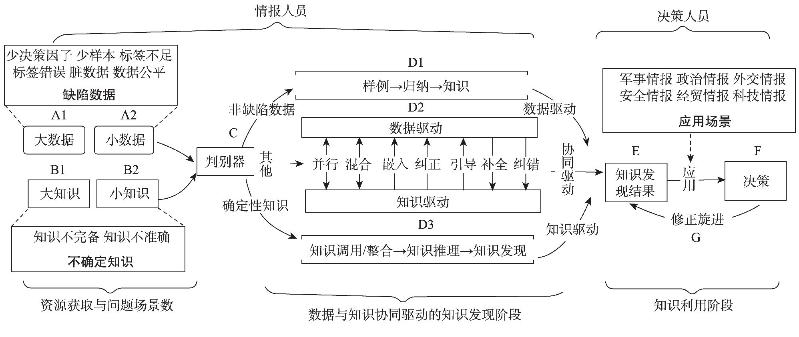
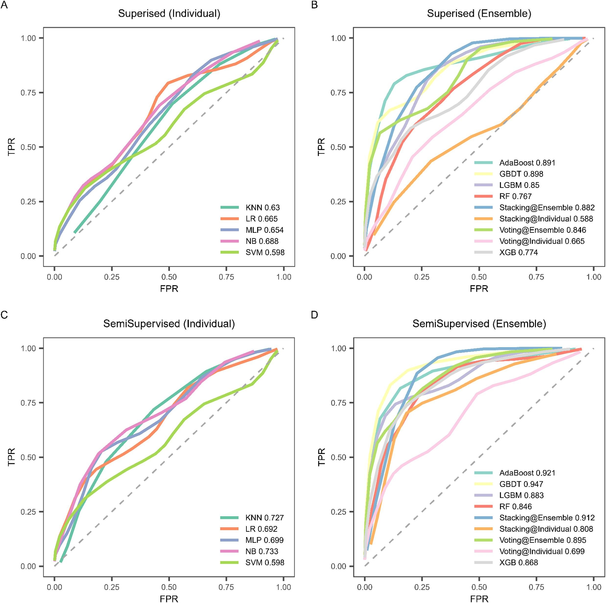
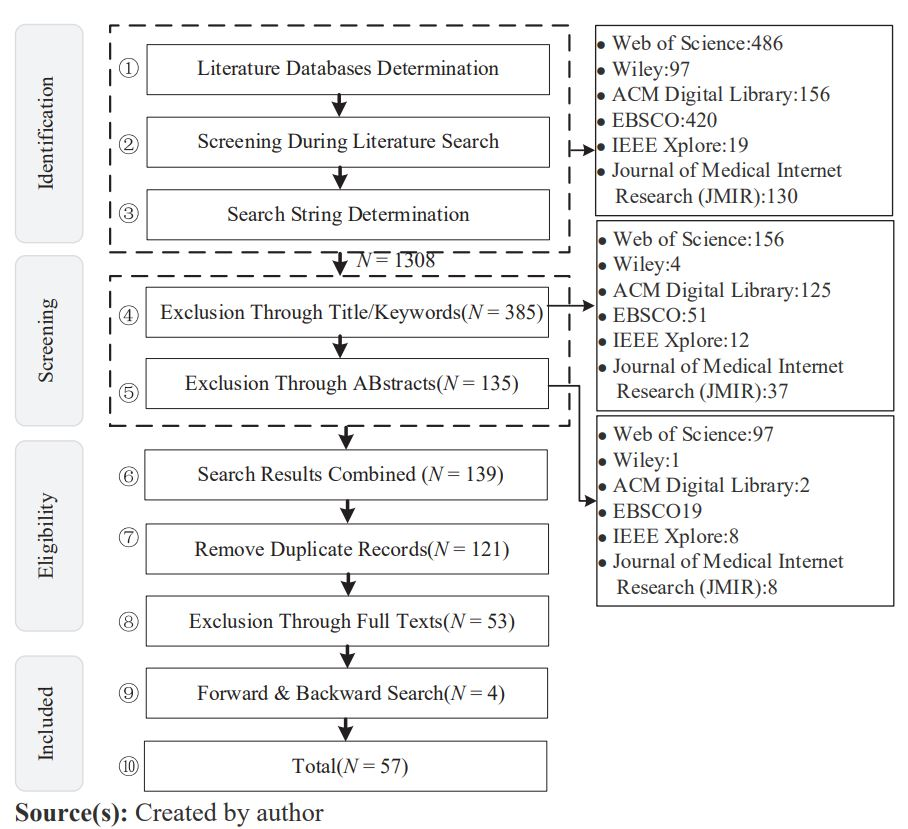
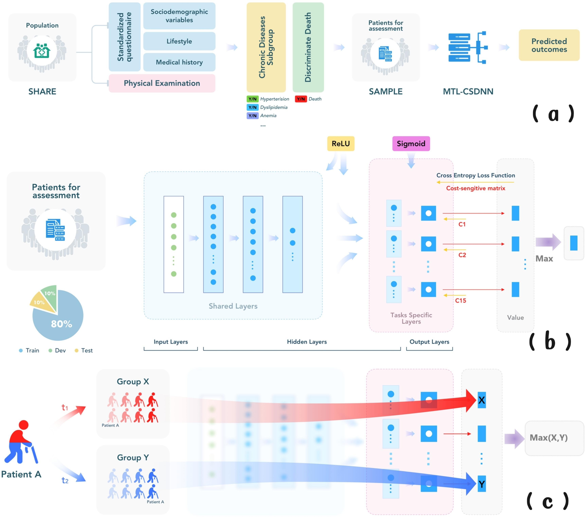








# ⛄︎ About Me

Hi! I am Yao Sumei, a doctoral candidate in Information Science at the School of Information Management, Wuhan University (Expected 2026).
Most recently, I pursued joint research at ETH Zürich under the supervision of <a href="https://mte.ethz.ch/people/person-detail.html?persid=14938">Prof. Dr. Peter Egger</a>, <a href="https://www.susierao.com/">Dr. Susie Xi Rao</a> and <a href="https://mte.ethz.ch/people/person-detail.html?persid=15026">Prof. Dr. Elgar Fleisch</a>. Before that, I have been conducting research at Wuhan University guided by <a href="https://im.whu.edu.cn/info/1015/1362.htm">Prof. Quan Lu</a>.

My work has been published in numerous SSCI, SCI and CSSCI core journals, and I am currently a senior reviewer for a wide range of top-tier Springer Nature journals. Beyond research, I have won multiple national scholarships and academic awards throughout my studies.

My research interests include literature knowledge discovery, automated medical systematic review, and machine learning.  I am always eager to engage in academic discussions and research cooperation. Feel free to reach out if you'd like to chat!

<a href="mailto:hi.sumeiyao@gmail.com">Email</a> / 
<a href="images/wechat.jpg">WeChat</a> /
<a href="images/qq.jpg">QQ</a> /
<a href="images/xiaohongshu.jpg">Xiaohongshu (RedNote)</a> /

# 🔥 News
- *2025.04*: &nbsp; *[Data and Knowledge Driven Knowledge Discovery: Concept, Mechanism and Model](https://qbxb.istic.ac.cn/CN/10.3772/j.issn.1000-0135.2025.03.003)* is accepted to  *Journal of The China Society for Scientific and Technical Information*! 🎉
- *2024.07*:  *[Enhancing identification performance of cognitive impairment high-risk based on a semi-supervised learning method](https://www.sciencedirect.com/science/article/pii/S1532046424001175)* is selected [Journal of Biomedical Informatics](https://www.sciencedirect.com/journal/journal-of-biomedical-informatics)!🎉
- *2024.07*:  *[Integrating multi-task and cost-sensitive learning for predicting mortality risk of elderly chronic diseases](https://pubmed.ncbi.nlm.nih.gov/39068894/)* is accepted to [International Journal of Medical Informatics](https://www.sciencedirect.com/journal/international-journal-of-medical-informatics)!🎉
- *2023.06*: *Utilizing health-related text on social media for depression research: themes and methods* is accepted by  *Library Hi Tech*🎉

# 📝 Selected Publications 

  

    

      
情报学报 2024

      
    

  

**Data and Knowledge Driven Knowledge Discovery: Concept, Mechanism and Model(数据与知识协同驱动的知识发现：概念、机理与模式**

**Sumei Yao**, Quan Lu

_*Journal of The China Society for Scientific and Technical Information_（情报学报)

[[PDF]](https://qbxb.istic.ac.cn/CN/10.3772/j.issn.1000-0135.2025.03.003)

<small>It proposes the concepts of defective data and uncertain knowledge, establishes the two-way collaborative mechanism, and systematically elaborates three categories of typical collaborative modeling modes: knowledge-driven (construction and correction modes), data-driven (embedding、 guiding and correction modes), and other collaborative discovery modes (hybrid and concurrent modes).</small>

JBI 2024

**Enhancing identification performance of cognitive impairment high-risk based on a semi-supervised learning method**

**Sumei Yao** , Yan Zhang, Jing Chen，Quan Lu, Zhiguang Zhao

_Journal of Biomedical Informatics,2024_

[[PDF]](https://arxiv.org/abs/2410.10481) 

<small>This study designs a semi-supervised learning algorithm and compares it with 14 traditional supervised machine learning methods and other advanced semi-supervised algorithms to identify high-risk cognitive impairment.</small>

LHT 2023

**Utilizing health-related text on social media for depression research: themes and methods**

**Yao, Sumei**; Wang, Fan; Chen, Jing; Lu, Quan

[[PDF]]([Utilizing health-related text on social media for depression research: themes and methods - ProQuest](https://www.proquest.com/docview/3162627467/52E22C515804702PQ/1?accountid=15157&sourcetype=Scholarly Journals))

<small>In depression research based on user-generated content, this study identifies 14 research topics and six research methods.</small>

IJMI 2024

**Integrating multi-task and cost-sensitive learning for predicting mortality risk of chronic diseases in the elderly using real-world data**

Aosheng Cheng, Yan Zhang, Zhiqiang Qian, Xueli Yuan, **Sumei Yao**, Wenqing Ni, Yijin Zheng, Hongmin Zhang, Quan Lu, Zhiguang Zhao

International Journal of Medical Informatics

[[PDF]]([[利用真实世界数据整合多任务和成本敏感学习，预测老年人慢性病的死亡风险——ScienceDirect](https://www.sciencedirect.com/science/article/pii/S1386505624002302#f0005)))

<small>Multi-task framework captures complex relationships of multiple chronic diseases; Accurate mortality risk prediction for real-world elderly populations; Deep learning exhibits strong performance on large-scale tabular data.</small>

# 🌍 Services

Senior Reviewer for Springer Nature (2024-), undertaking review work for top international journals:

- [Nature Medicine](https://www.nature.com/nmed/) (SCI Q1, CAS Q1, Top Journal, IF: 50.0, Invited Co-Review)
- [Nature Methods](https://www.nature.com/nmeth/) (SCI Q1, CAS Q1, Top Journal, IF: 32.1)
- [Nature Human Behaviour](https://www.nature.com/nhumbehav/) (SCI Q1, CAS Q1, Top Journal, IF: 15.9)
- [Nature Communications](https://www.nature.com/ncomm/) (SCI Q1, CAS Q1, Top Journal, IF: 15.7)
- [Artificial Intelligence Review](https://link.springer.com/journal/10462) (SCI Q1, CAS Q1, Top Journal, IF: 13.9)
- [BMC Geriatrics](https://bmcgeriatr.biomedcentral.com/) (SCI/SSCI Q1, CAS Q2, Top Journal, IF: 3.9)
- [Scientific Reports](https://www.nature.com/srep) (SCI Q1, CAS Q2, IF: 3.9)
- [BMC Medical Informatics and Decision Making](https://bmcmedinformmedec.biomedcentral.com/) (SCI Q2, CAS Q3, IF: 3.8)
- [BMC Public Health](https://bmcpublichealth.biomedcentral.com/) (SCI Q1, CAS Q2, Top Journal, IF: 3.6)
- [Humanities and Social Sciences Communications](https://www.nature.com/hsscomm/) (SCI/SSCI Q1, CAS Q2, IF: 3.6)
- [Quality of Life Research](https://link.springer.com/journal/11136) (SCI Q2, CAS Q3, IF: 3.3)
- [Discover Mental Health](https://www.nature.com/discovermentalhealth/) (SCI Q2, CAS Q3, IF: 3.2)
- [npj Mental Health Research](https://www.nature.com/npjmentalhealth/) (SCI Q2, CAS Q3, IF: 3.1)

# 💼 Experience

  

    
  

  

### Eidgenössische Technische Hochschule Zürich

2024.04 - 2025.04  

Research Guest 

Advisor: [Prof. Dr. Peter Egger](https://mtec.ethz.ch/people/person-detail.MTY2NTM0.TGlzdC8xMDUwLC0yMDgyMjgwMDQ4.html), <a href="https://www.susierao.com/">Dr. Susie Xi Rao</a>

  

  

    
  

  

###  Wuhan University

2021.09 - 2026.06  

Ph.D Candidate  

Advisor: [Prof. Quan Lu](https://sim.whu.edu.cn/info/1631/13987.htm)

  

# 🎖 Selected Honors and Awards
- *2024* Second Prize, Wuhan University Academic Innovation Award.
- *2021.04* Outstanding Graduate, Hebei Province.
- *2021.01* Outstanding Graduate, YanShan University.
- *2020.11* Second Prize in Hebei Provincial MBA Entrepreneurship Planning Competition.
- *2019.11* Provincial Silver Award , 5th Hebei Provincial Internet Plus Innovation Competition.
- *2019.09* **National Third Prize** , 9th National College Students Innovation and Entrepreneurship Competition.🥇
- *2019–2020* **National Postgraduate Scholarship**, China.🥇
- *2018–2019* **National Postgraduate Scholarship**, China.🥇
- *2018–2019* Merit Student, YanShan University.
- *2015–2016* **National Inspirational Scholarship**, China.🥇

# 🌈 Miscellaneous

Apart from academic studies and research, I have a wide range of interests.

- 💃 I love dancing Latin dance, **Rumba** especially, but only at an amateur level.
- 💻 I enjoy developing interesting small software and writing them into software copyrights.
-  Besides, I like hiking 🚣and traveling✈︎, and the scenery of the Alps🏔 is always fascinating.

